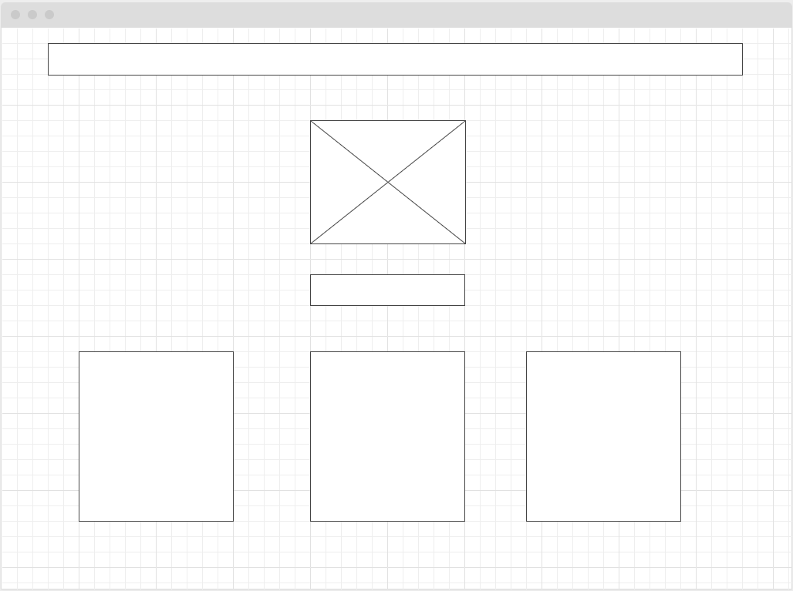
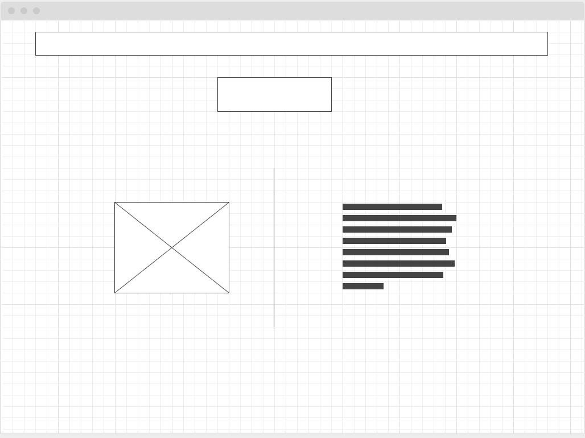
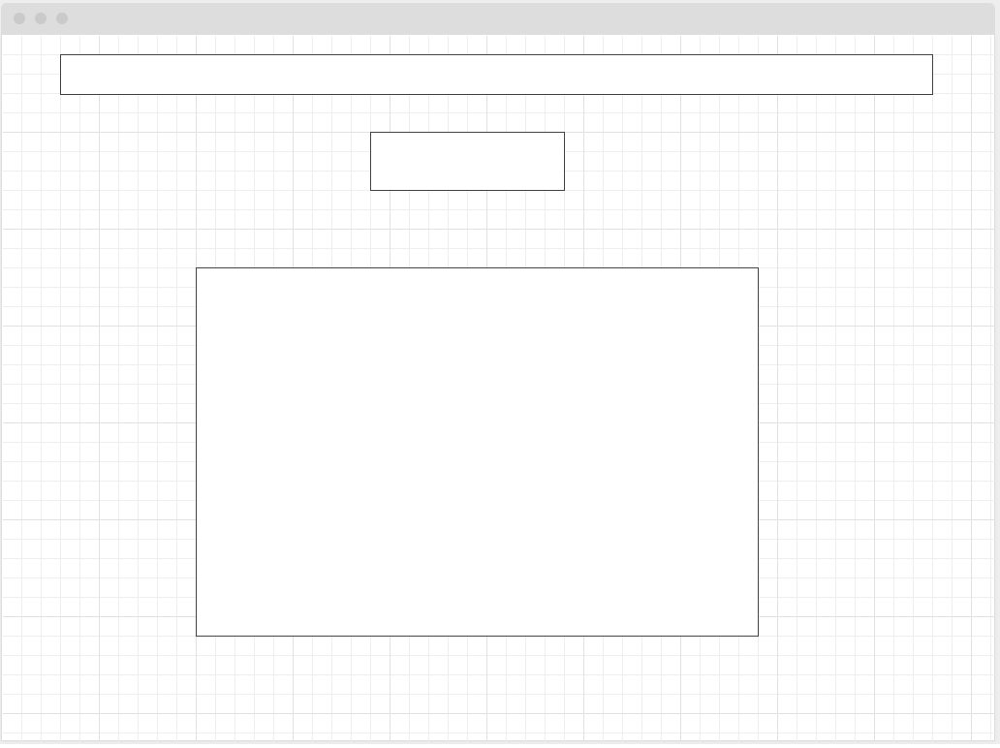
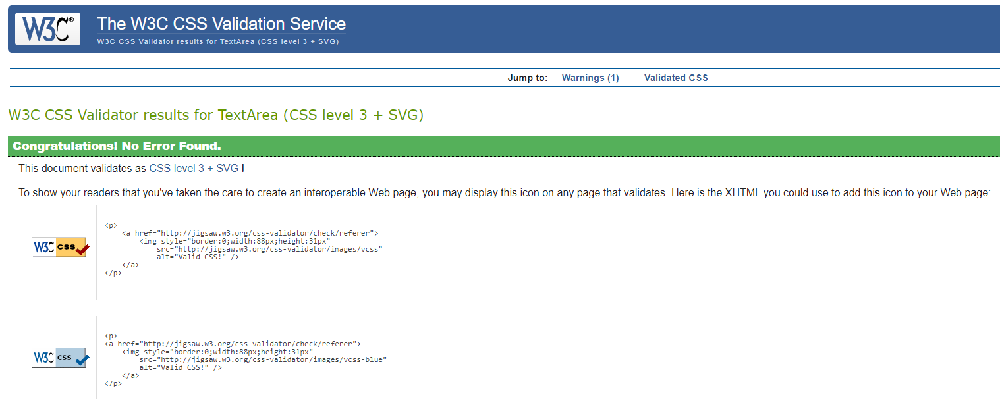

# Milestone-Project-1---Personal-Portfolio-Website

This ia a link to the live Portfolio Website: [Live Version](https://r-mack.github.io/Milestone-Project-1---Personal-Portfolio-Website/)

# Project Title

Portfolio of my web dev projects.

## Description

This website is a portfolio of my web dev projects. The user is provided with an easy-to-use example of my skill as a developer, also there is easily identifiable contact details and links to my professional social media profiles. 

## UX

### Project Goals

To create a clean and simple way to display my portfolio of work to potential employers.

### User Stories

Potential Employers want:

1. To quickly be able to find my past projects.
2. To quickly find information about my past education.
3. To quickly and easily find information to contact me.
4. To get a feel for my work capabilities and personality.

### Design Choices

* __Font:__  I chose "Nova Mono" due to it being easy to read yet stylish, fun and professional at the same time.

* __Icons:__ I used icons to improve useability and to keep the site clean.

* __Colours:__ I found a soft blue to look friendly, welcoming and professional. The lightness of the colour worked well at providing contrast for the black text underneath and the white background.

* __Styling:__ The use of cards to display the projects made them easy to navigate and apparent when viewing the homepage. The use of a rounded profile image was use to show my face in a friendly way. The fixed navbar was used to improve visibility on smaller screens. I decided on not including a footer as it would not come accross as friendly as I would of liked.

### Wireframes

1. Home: 




2. About & Projects: 




3. Contact Page: 




## Programming Languages and Frameworks

* HTML 5
* CSS
* Bootstrap


### Dependencies

* Describe any prerequisites, libraries, OS version, etc., needed before installing program.
* ex. Windows 10

### Installing

* How/where to download your program
* Any modifications needed to be made to files/folders

### Executing program

* How to run the program
* Step-by-step bullets
```
code blocks for commands
```


## Media

* All external images are sourced from: [Unsplash](https://unsplash.com/)

* All external icons are sourced from: [FontAwesome](https://fontawesome.com/)

* All external fonts are souced from: [Google Fonts](https://fonts.google.com/)

## Referenced Code

* Credit navbar code inspiration to examples presented in: [Bootstrap 4 Navs](https://getbootstrap.com/docs/4.6/components/navs/)
* Credit project cards to code inspiration to examples presented in: [Bootstrap 4 Cards](https://getbootstrap.com/docs/4.6/components/card/)
* Referenced Contact Form to the example in this website: [Bbbootstrap - Bootstrap 4 Simple Contact Form](https://bbbootstrap.com/snippets/simple-contact-form-74408136)

## Testing

I tested all the code through the validators and performance testers making the suggested changes until the project was run successfully.

This project was sucessfully ran through these two validators: 

* [Jigsaw CSS Validator](https://jigsaw.w3.org/css-validator/validator)



* [W3 HTML Validator](https://validator.w3.org/)


Performance was Tested using:

* [Google Developer Tools - Lighthouse](https://developer.chrome.com/docs/devtools/speed/get-started/)


## Contact

Email: reynold.1234@gmail.com
Linkedin: https://www.linkedin.com/

## Acknowledgments

*  [Code Institute](https://codeinstitute.net/)
*  [Bootstrap Documentation](https://getbootstrap.com/)
*  Darío Carrasquel: addario7777@gmail.com
*  https://bbbootstrap.com/snippets/simple-contact-form-74408136