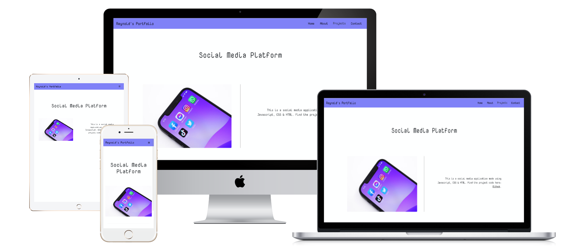
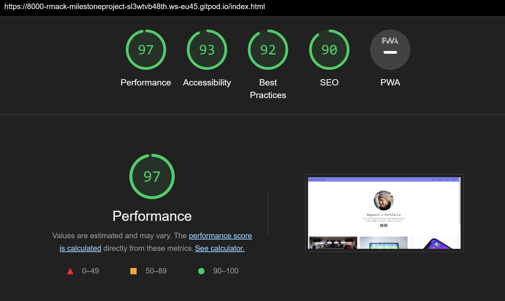

# Milestone-Project-1---Personal-Portfolio-Website

This ia a link to the live Portfolio Website: [Live Version](https://r-mack.github.io/Milestone-Project-1---Personal-Portfolio-Website/)

# Reynold's Portfolio Website

## Preview Screenshots

1. Home: 

2. Contact: 

3. Game: 

3. Social Media Platform: 

3. Store: 

3. About: 

## Description

This website is a portfolio of my web dev projects. The user is provided with an easy-to-use example of my skill as a developer, also there is easily identifiable contact details and links to my professional social media profiles. 

## UX

### Project Goals

To create a clean and simple way to display my portfolio of work to potential employers.

### User Stories

Potential Employers want:

1. To quickly be able to find my past projects.
2. To quickly find information about my past education.
3. To quickly and easily find information to contact me.
4. To get a feel for my work capabilities and personality.

### Design Choices

* __Font:__  I chose "Nova Mono" due to it being easy to read yet stylish, fun and professional at the same time.

* __Icons:__ I used icons to improve useability and to keep the site clean.

* __Colours:__ I found a soft blue to look friendly, welcoming and professional. The lightness of the colour worked well at providing contrast for the black text underneath and the white background.

* __Styling:__ The use of cards to display the projects made them easy to navigate and apparent when viewing the homepage. The use of a rounded profile image was use to show my face in a friendly way. The fixed navbar was used to improve visibility on smaller screens. I decided on not including a footer as it would not come accross as friendly as I would of liked.

### Wireframes

1. Home: 

2. About & Projects: 

3. Contact Page: 

## Programming Languages and Frameworks

* HTML 5
* CSS
* Bootstrap

## Media

* All external images are sourced from: [Unsplash](https://unsplash.com/)

* All external icons are sourced from: [FontAwesome](https://fontawesome.com/)

* All external fonts are souced from: [Google Fonts](https://fonts.google.com/)

## Referenced Code

* Credit __navbar__ code inspiration to examples presented in: [Bootstrap 4 Navs](https://getbootstrap.com/docs/4.6/components/navs/)
* Credit __project cards__ to code inspiration to examples presented in: [Bootstrap 4 Cards](https://getbootstrap.com/docs/4.6/components/card/)
* Referenced __Contact Form__ to the example in this website: [Bbbootstrap - Bootstrap 4 Simple Contact Form](https://bbbootstrap.com/snippets/simple-contact-form-74408136)

## Testing

I tested all the code through the validators and performance testers making the suggested changes until the project was run successfully.

The code was test on various screen sizes to ensure usability on many different devices.

This project was sucessfully ran through these two validators: 

* [Jigsaw CSS Validator](https://jigsaw.w3.org/css-validator/validator)

* [W3 HTML Validator](https://validator.w3.org/)

Performance was Tested using:

* [Google Developer Tools - Lighthouse](https://developer.chrome.com/docs/devtools/speed/get-started/)

## Deployment

This project was developed using the [Gitpod IDE](https://gitpod.io/) environment, Git was used for version control and to push to the main branch at Github.

### Deploying a Github Pages Hosted Version

To deploy this project from the project's [Respository](https://github.com/R-Mack/Milestone-Project-1---Personal-Portfolio-Website) follow these steps: 

1. Log into Github.
2. From the list of repositories on the screen, select **R-Mack/Milestone-Project-1---Personal-Portfolio-Website**.
3. From the menu items near the top of the page, select **Settings**.
4. Scroll down to the **GitHub Pages** section.
5. Under **Source** click the drop-down menu labelled **None** and select **Master Branch**
6. On selecting Master Branch the page is automatically refreshed, the website is now deployed. 
7. Scroll back down to the **GitHub Pages** section to retrieve the link to the deployed website.

### Using Gitpod:

1. A Github account. [Create a Github account here](https://github.com/)
2. A Chrome based browser is recommended.
3. Install the [Gitpod Browser Extentions for Chrome](https://www.gitpod.io/docs/browser-extension/)
4. After installation, restart the browser.
5. Log into [Gitpod](https://gitpod.com) with your gitpod account.
6. Navigate to the [Project GitHub repository](https://github.com/R-Mack/Milestone-Project-1---Personal-Portfolio-Website)
7. Click the "Gitpod" button in the top right corner of the respository.
8. This will initiate a local gitpod workspace.

### Using a Local IDE:

1. Follow this link to the [Project GitHub repository](https://github.com/R-Mack/Milestone-Project-1---Personal-Portfolio-Website).
2. Under the repository name, click "Clone or download".
3. In the Clone with HTTPs section, copy the clone URL for the repository. 
4. In your local IDE open the terminal.
5. Change the current working directory to a required location.
6. Type "__git clone__", and then paste the repository URL.
7. Press Enter. Your local clone will be created.

## Forking

1. Follow this link to the [Project GitHub repository](https://github.com/R-Mack/Milestone-Project-1---Personal-Portfolio-Website).
2. Under the repository name, click "Clone or download".
3. To clone the repository using HTTPS, under "Clone with HTTPS", copy the link.
4. Open Git Bash
5. Change the current working directory to the location where you want the cloned directory to be made.
6. Type "git clone", and then paste the URL you copied in Step 3.
7. Press Enter. Your local clone will be created.

## Cloning

## Contact

Email: reynold.1234@gmail.com
Linkedin: https://www.linkedin.com/

## Acknowledgments

*  [Code Institute](https://codeinstitute.net/)
*  [Bootstrap Documentation](https://getbootstrap.com/)
*  https://bbbootstrap.com/snippets/simple-contact-form-74408136
*  I took inspiration for this ReadMe document from [AJGreaves](https://github.com/AJGreaves/portrait-artist/blob/master/README.md)

## Disclaimer

The content of this Website is for personal purposes only.